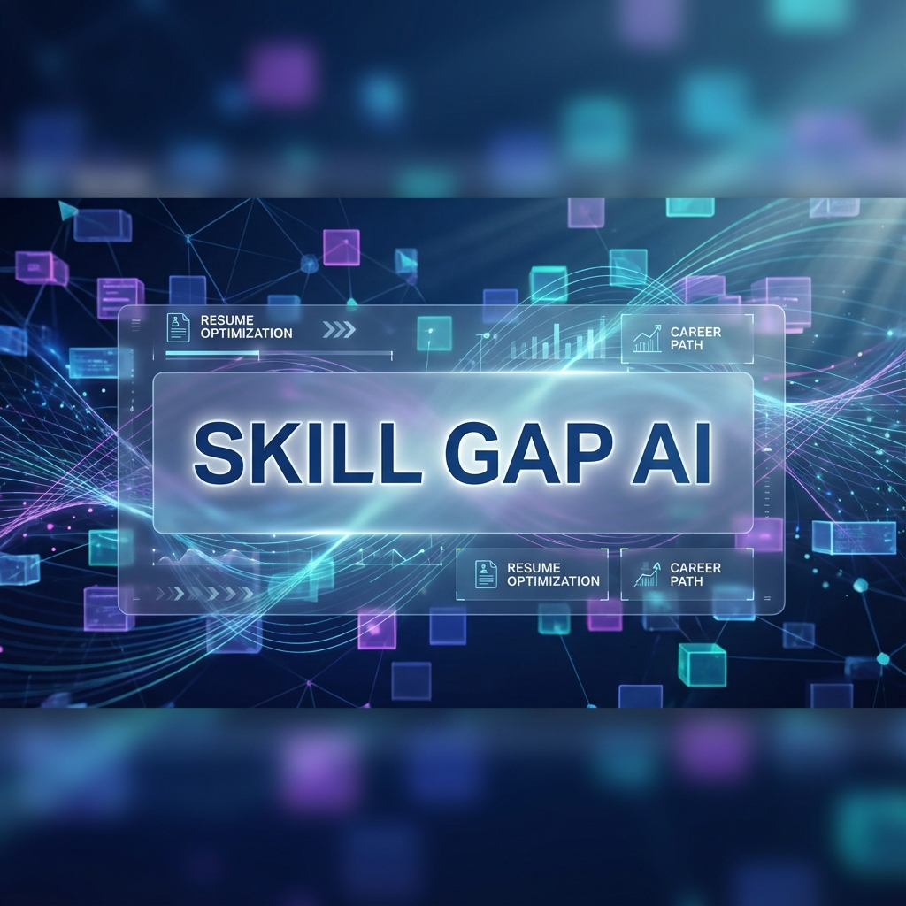
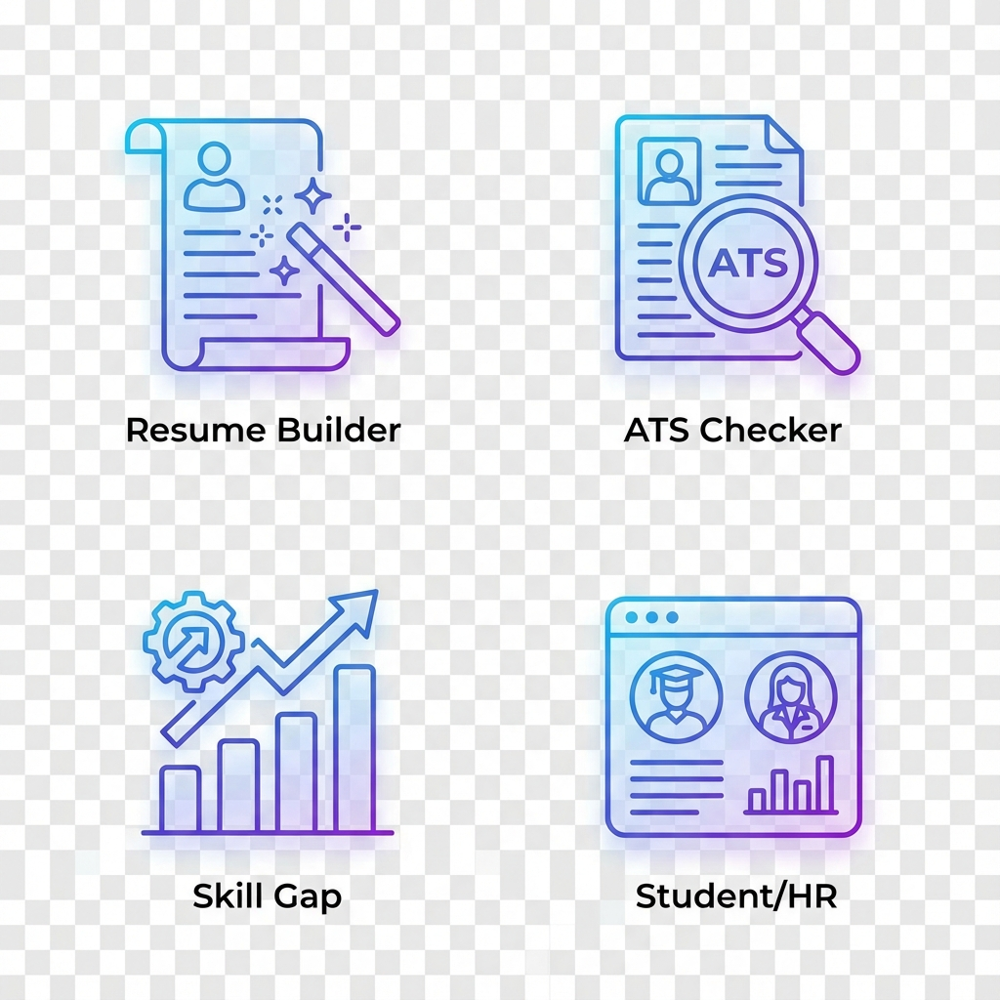

<div align="center">



# ✨ Skill Gap AI: The Future of Career Growth
### *Intelligent Resume Engineering • ATS Optimization • Skill Analytics*

[](https://github.com/Karthi-1211/Skill-Gap-AI/stargazers)
[](https://skill-gap-ai.streamlit.app/)
[](https://www.python.org/)
[](https://opensource.org/licenses/MIT)

---

<p align="center">
  <b>Skill Gap AI</b> is not just a tool; it's your personal AI-powered career coach. Whether you are a student striving to bridge the gap between education and industry, or an HR professional looking for the perfect fit, our platform provides the precision and insights you need.
</p>

[**🚀 Launch App**](https://skill-gap-ai.streamlit.app/) • [**📽️ View Demo**](#) • [**📄 Documentation**](#) • [**🤝 Support**](https://github.com/Karthi-1211/Skill-Gap-AI/issues)

</div>

---

## � Project Highlights

<div align="center">

</div>

<br>

<table align="center" border="0">
  <tr>
    <td width="50%" valign="top">
      <h3>🚀 Premium Resume Builder</h3>
      <ul>
        <li><b>16+ Executive Templates:</b> Curated designs for every industry.</li>
        <li><b>Live Adaptive Editor:</b> Dynamic fields that change with your template.</li>
        <li><b>Interactive Preview:</b> Instant visual feedback as you build.</li>
      </ul>
    </td>
    <td width="50%" valign="top">
      <h3>🔍 Intelligent ATS Auditor</h3>
      <ul>
        <li><b>Deep Semantic Analysis:</b> Beyond keyword matching.</li>
        <li><b>Enterprise Simulation:</b> See what recruiters see in their dashboard.</li>
        <li><b>Risk Detection:</b> Identifies formatting and parsing vulnerabilities.</li>
      </ul>
    </td>
  </tr>
  <tr>
    <td width="50%" valign="top">
      <h3>📊 Skill Gap Analytics</h3>
      <ul>
        <li><b>JD-Resume Alignment:</b> Precise extraction of missing competencies.</li>
        <li><b>Visual Growth Charts:</b> Interactive dashboards for progress tracking.</li>
        <li><b>Personalized Roadmap:</b> Knowing exactly what to learn next.</li>
      </ul>
    </td>
    <td width="50%" valign="top">
      <h3>👥 Dual-Core Dashboards</h3>
      <ul>
        <li><b>Student Portal:</b> Application tracking and personalized insights.</li>
        <li><b>HR Central:</b> Rank candidates and manage pipelines with AI.</li>
        <li><b>Seamless Sync:</b> Real-time updates between candidates and recruiters.</li>
      </ul>
    </td>
  </tr>
</table>

---

## 🛠️ The Tech Ecosystem

<div align="center">

| Area | Technologies |
| :--- | :--- |
| **Interface** |    |
| **AI/NLP Engine** |    |
| **Logic & Data** |    |
| **Export Engine** |   |

</div>

---

## ⚡ Quick Start

```bash
# 1. Clone the future
git clone https://github.com/Karthi-1211/Skill-Gap-AI.git && cd Skill-Gap-AI

# 2. Prepare the environment
python -m venv venv && source venv/bin/activate # Unix
# Or .\venv\Scripts\activate for Windows

# 3. Fuel the engine
pip install -r requirements.txt
python -m spacy download en_core_web_sm

# 4. Ignite
streamlit run main.py
```

---

## 📂 Architecture at a Glance

```bash
# Core Application Flow
├── main.py              # 🏠 The Command Center
├── home_page.py         # 🌐 The Landing Experience
├── resume_builder.py    # ✍️ The Content Engine
├── ats_score.py         # ⚖️ The Auditor Logic
├── student_dashboard.py # 📈 The Growth Tracker
└── hr_dashboard.py      # 🎯 The Talent Hunter
```

---

## 🌟 Why Skill Gap AI?

> *"The future belongs to those who learn more skills and combine them in creative ways."*
> 
> Skill Gap AI was built to solve the transparency problem in job applications. We bring the power of enterprise ATS systems to the fingertips of every job seeker, while providing HR teams with the most intelligent candidate filtering available today.

---

<div align="center">

### 🤝 Join the Revolution

Contributions, issues, and feature requests are welcome!<br>Feel free to check [issues page](https://github.com/Karthi-1211/Skill-Gap-AI/issues).

**Give a ⭐️ if this project helped you!**

<br>

<p align="center">
  
</p>

Built by **[Karthi](https://github.com/Karthi-1211)**

</div>
